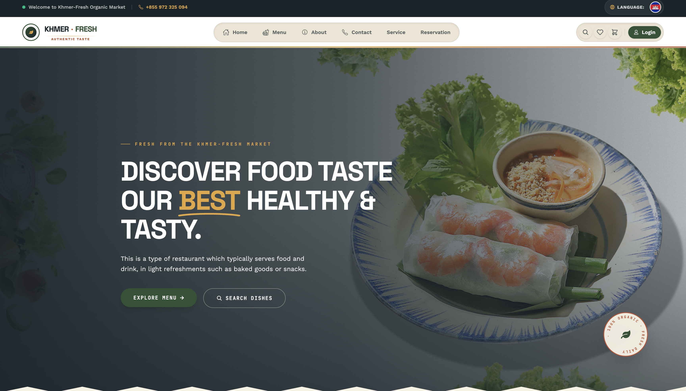
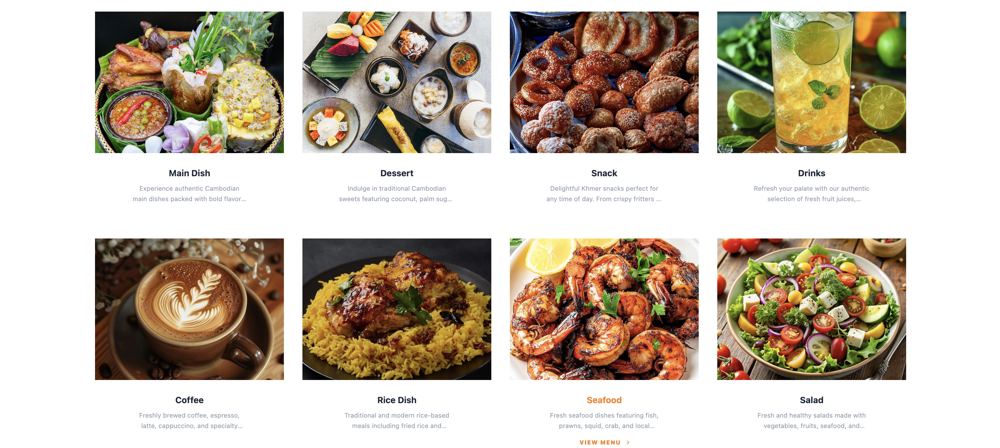
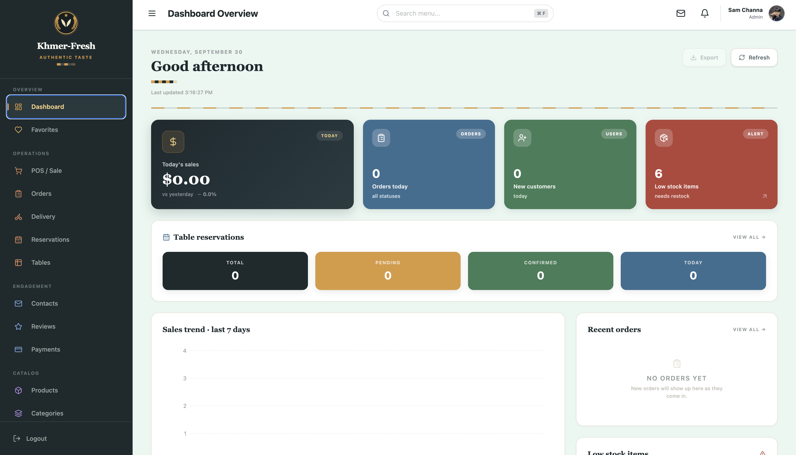

# Khmer-Fresh Food Shop 🥗

A full-stack restaurant ordering system for a Cambodian food shop: a customer storefront with cart, checkout and KHQR payment, plus an admin dashboard with a POS terminal, orders, delivery and reports. This repository contains the **React frontend**.

🔗 **Live Demo:** https://food-shop-api.vercel.app

> ⏳ The backend is hosted on a free plan. If it has been idle, the first load can take about 50 seconds while the server wakes up.

🧩 **Backend repository:** https://github.com/Chana758/Food_Shop_Backend



## Demo accounts

| Role  | Email                    | Password         |
| ----- | ------------------------ | ---------------- |
| Admin | `demo-admin@example.com` | `DemoAdmin@2026` |
| Staff | `demo-staff@example.com` | `DemoStaff@2026` |
| User  | `demo-user@example.com`  | `DemoUser@2026`  |

## Features

### Customer

- Browse the menu by category, with search, price range and sorting
- Product pages with discounts and customer reviews
- Favorites, shopping cart and checkout (cash on delivery or KHQR)
- Table reservation
- Khmer / English language switch

### Staff

- Dashboard with sales, orders, low-stock alerts and live order queues
- POS terminal with cash, card and KHQR payment and receipt printing
- Handle orders and table reservations
- Read customer contacts and reviews
- View payments

### Admin

Everything Staff can do, plus:

- Manage products, categories, delivery and tables
- Manage staff and customers
- Reports, scheduled backups, trash and site settings

## Screenshots

| Categories | Admin dashboard |
| ---------- | --------------- |
|  |  |

## Tech stack

| Layer      | Technology                                    |
| ---------- | --------------------------------------------- |
| Frontend   | React, Vite, Tailwind CSS, React Router       |
| Data       | Axios, custom hooks, react-i18next            |
| Payments   | KHQR (Bakong)                                 |
| Backend    | Laravel (PHP)                                 |
| Database   | Supabase (PostgreSQL)                         |
| Deployment | Vercel (frontend), Docker on Render (backend) |

## Getting started

```bash
git clone https://github.com/Chana758/Food_Shop_API.git
cd Food_Shop_API
npm install
npm run dev
```

By default the app uses the hosted backend. To use a local Laravel backend, create `.env.local`:

```env
VITE_API_URL=http://127.0.0.1:8000/api
VITE_API_BASE_URL=http://127.0.0.1:8000
```

## Author

**Chana** · [GitHub](https://github.com/Chana758)
